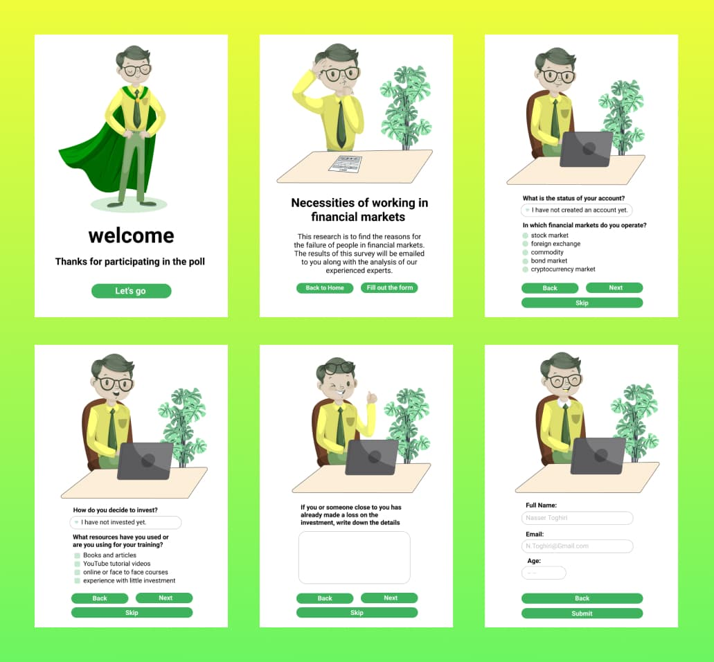

# Financial Survey

Help us to find the reasons for the failure of people in financial market. Answer the survey and get exclusive content from our experts.

Desktop Preview            |  Mobile Preview
:-------------------------:|:-------------------------:
 | 

## How to run

Clone this repository:
``` sh
git clone git@github.com:gabriel-venezian/financial-survey.git
```

Simply open the <a href="https://github.com/gabriel-venezian/financial-survey/blob/main/index.html" target="_blank">index.html</a> file in your browser. You can also run it through the VSCode `Live Server` extension.

## Check it out
In the <a href="https://github.com/gabriel-venezian/financial-survey/blob/main/scripts/global/global.js">global.js</a> file you can find some interesting functions to manipulate the default width of html select element (based on the current selected option width). These functions were constructed using the `canvas` and `getComputedStyle` methods. 

## Acknowledgments
This project was developed during the Compass Front-end Cloud Context internship program. I would like to thank all of my colleagues that shared their will and knowledge during the developement of the proposed work. 
